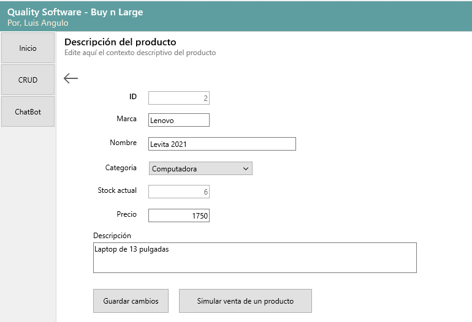
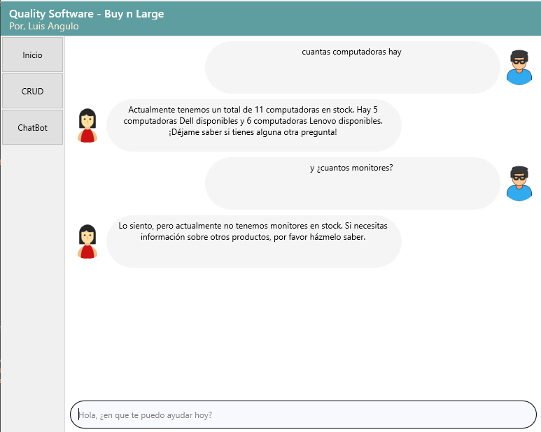

# Saludos
Es proyecto ha sido realizado tratando de cumplir con los requi sugeridos por 
empresa Quality Software

El presente software es una prueba de concepto que intenta cumplir con la solicitud exigida por la empresa 
Quality Software.

El back utilizado ha sido desarrollado en Go (golang), con lo cual intento destacar el potencial que tiene 
Delphi para conectar vía http con otras aplicaciones.

El front ha sido diseñado en Delphi, utilizando dos de los framework más populares y exitosos en ese lenguaje 
(Spring4D, DMVCFramework), por lo que al intentar compilar el código fuente debe tenerse instalado ambos framework.

El servidor de datos utilizados ha sido SQL Server, con tablas sumamente sencillas y fáciles de editar.

Ambas aplicaciones (back/front) implementan condiciones mínimas para el tratamiento de datos, con arquitecturas 
de diseño convencionales especialmente orientadas al aprendizaje, sobre todo el back; por lo tanto, el código 
entregado es sumamente minimalista, y puede ser reutilizado para proyectos de alta envergadura.

# División del Proyecto

## Base de datos

* Servidor: SQL Server
* Base de datos: buynlarge
* Autenticación: Usuario del sistema

En \scripts\metadata.sql encontrará los scripts requeridos para generar su base de datos.

## Backend

* Lenguaje: Go
* Framework: ninguno (100% minimalista)

\db         contiene las unidades necesarias para la conexión a base de datos

\delphi     es la capa cliente del proyecto

\handlers   contiene los controladores necesarios para la gestión de datos

\models     define los modelos de datos usados por las estructuras

\render    renderizador sencillo para las respuestas http

\script     metadata para la construcción de la base de datos

\output     contiene el archivo comprimido buynlarge_apps.zip, allí están los ejecutables para las pruebas.

El proyecto se integra con OpenAI, por lo que debe crear una cuenta en dicha plataforma y obtener un APIKEY,
una vez la consiga, vaya al archivo .env del proyecto y asigne la variable OPENAI_API_KEY. Esta asignación debe
hacerla también en el archivo .env de la carpeta \output, que es donde actualmente está el ejecutable del proyecto, 
el cual fue compilado en modo depurador para que usted pueda ver las solicitudes recibidas.

La OPENAI_API_KEY proporcionada para el proyecto es personal, y tiene tiempo de caducidad por fecha y/o consumo.

El acceso a datos es con sql directo, muy sencillo, pues al ser un proyecto muy pequeño, no hubo necesidad 
de emplear algún ORM para la gestión de datos.

El servicio http se realiza mediante la aplicación buynlarge_server, y utiliza el puerto 8080, por lo que 
debe asegurarse que no este siendo previamente utilizado por otra aplicación antes de ejecutar esta.

## Frontend

* Lenguaje: Delphi
* Framework: Spring4d, DMVCFramework

Para poder compilar y ejecutar el proyecto front en su entorno delphi, en necesario que instale las librerias
de Spring4d y DMVCFramework,

Spring4d
https://bitbucket.org/sglienke/spring4d/downloads/

DMVCFramework
https://github.com/danieleteti/delphimvcframework

El proyecto es igualmente sencillo, incluye una sección CRUD donde puede crear productos, editarlos y listarlos, 
no se incluyó la opción de eliminación.

También incluye la sección de Chat, donde podrá hacer preguntas básicas al servidor, como por ejemplo:
¿Cuántas computadoras hay?, ¿Cuántos monitores tenemos?

Tenga en cuenta que las preguntas son básicas, pues analizar expresiones para diseñar consultas SQL es un
tema avanzado, que requiere una mayor inversión de tiempo al proporcionado.

Aunque la interfaz para el chat es muy amigable e intuitiva, aún requiere de mejoras en la sincronización
y pintado de los mensajes, esto, cuando la cantidad de mensaje excede el área visible del componente de
desplazamiento, pues empiezan a mostrarse de forma irregular.

## Crédito
* Luis Angulo
* alesoftca@gmail.com
* +57 3002888018

